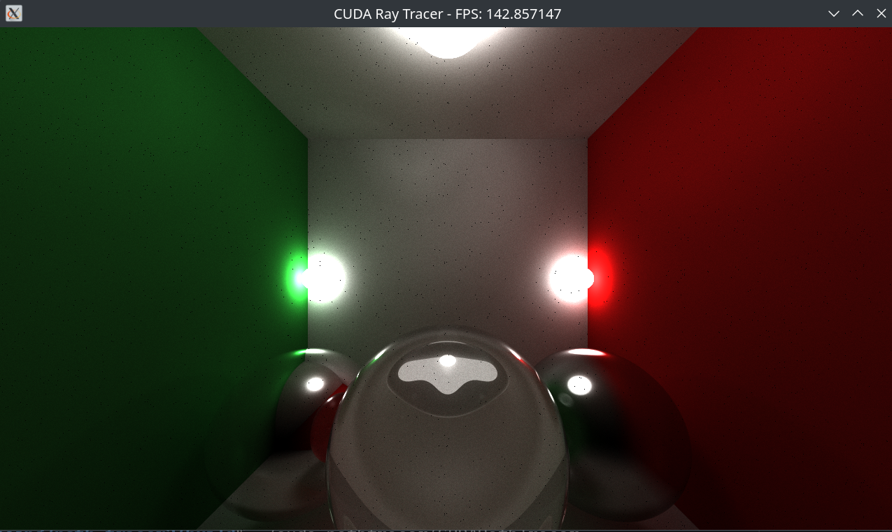
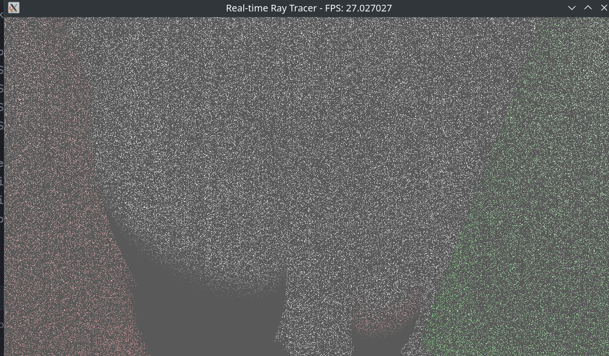

# Monte Carlo Path Tracer: CUDA vs CPU Implementation

This repository contains two implementations of a path tracer: one using CUDA for GPU acceleration and another using CPU multi-threading. The comparison demonstrates the significant performance advantage of GPU-based path tracing for real-time rendering.

<table>
  <tr>
    <td align="center" width="50%">
      
      <br>
      <strong>CUDA Path Tracer (40 FPS)</strong>
    </td>
    <td align="center" width="50%">
      
      <br>
      <strong>CPU Path Tracer (10~25 FPS)</strong>
    </td>
  </tr>
</table>

## Project Structure

```
.
├── cuda_pathtracer/    # GPU-accelerated implementation
└── cpu_pathtracer/     # CPU-based implementation
```

## Scene Preview

[Insert screenshot of your rendered scene here]

The scene features:
- A Cornell box with colored walls (red and green sides)
- Multiple spheres with different materials:
  - Glass (refractive)
  - Metal (reflective)
  - Glossy (mixed specular/diffuse)
- Multiple colored lights for interesting illumination effects
- Real-time camera movement and interaction

## Performance Comparison

### CUDA Path Tracer
- **Frame Rate**: 40 FPS on 4060 GPU
- **Resolution**: 1280x720
- **Features**:
  - Real-time rendering
  - Interactive camera movement
  - Progressive refinement
  - Multiple material types (Diffuse, Glossy, Specular, Glass)
  - Colored lighting effects
  - Monte Carlo path tracing with importance sampling

### CPU Path Tracer
- **Frame Rate**: 10~20 FPS
- **Resolution**: 1280x720
- **Features**:
  - Same features as CUDA version but significantly slower
  - Multi-threaded rendering using OpenMP
  - Progressive refinement (but much slower accumulation)
  - Demonstrates why GPU acceleration is necessary for real-time path tracing

## Why CUDA is Necessary

The CPU version demonstrates why GPU acceleration is essential for real-time path tracing:
1. **Parallelization**: Path tracing is inherently parallel - each pixel can be computed independently
2. **Ray-Object Intersection**: GPU can perform thousands of intersection tests simultaneously
3. **Monte Carlo Sampling**: Random sampling and light calculations benefit from massive parallelization
4. **Memory Access**: GPU's high memory bandwidth is crucial for accessing scene data

## Building and Running

### CUDA Version
```bash
mkdir build && cd build
cmake ..
make
./cuda_pathtracer/CUDAPathTracer
./cpu_pathtracer/CPUPathTracer
```

## Controls(only CPU version)
- **W/A/S/D**: Move camera
- **Mouse**: Look around
- **Tab**: Toggle mouse capture
- **Escape**: Exit

## Requirements

### CUDA Version
- CUDA Toolkit 11.0 or higher
- NVIDIA GPU with Compute Capability 6.0 or higher
- C++17 compatible compiler
- CMake 3.18 or higher
- X11 development libraries(Linux)

### CPU Version
- C++20 compatible compiler
- CMake 3.18 or higher
- OpenMP
- X11 development libraries

## Technical Details

Both implementations use:
- Monte Carlo path tracing
- Multiple importance sampling
- Real-time progressive refinement
- Various material types (diffuse, glossy, specular, glass)
- Scene management with implicit objects
- Interactive camera controls(Cuda version has bugs)

